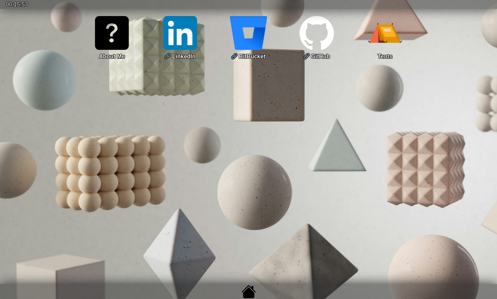

# blog-website

My very own personal website!

This is an entirely static website built with SvelteKit designed to be served through GitHub pages.

## Requirements

Building this project requires only NodeJS's **NPM**. On Fedora Linux, NPM is installed together with the NodeJS pacakge: `# dnf install nodejs`.

## Building

1. Navigate to the source directory `blog-website/`.

2. Install all the NodeJS dependencies with `$ npm install`.

3. Build the project with `$ npm run build`.

The built website will be located in the `build/` directory.
